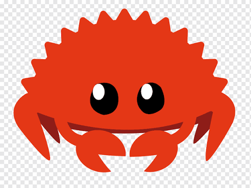

<h2 align="left">sup, im ancespiroez 💀</h2>

###

###

<pre>
┌──────────────────────────────────────┐
│ who                                  │
└──────────────────────────────────────┘
Generalist vibe coder.

┌──────────────────────────────────────┐
│ os                                   │
└──────────────────────────────────────┘
</pre>

  
  
  
  
  
  
  

<pre>
┌──────────────────────────────────────┐
│ tech                                 │
└──────────────────────────────────────┘
</pre>

  
  
  
  
  
  
  
  
  
  
  

<pre>
┌──────────────────────────────────────┐
│ ai i vibe with                       │
└──────────────────────────────────────┘
</pre>

  
  
  
  
  
  
  

###

  
  

###

  

